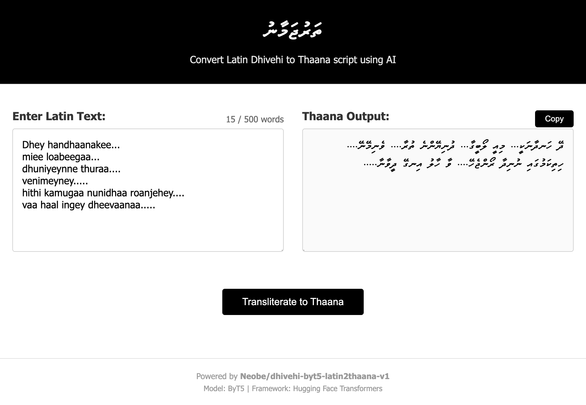

# Dhivehi Latin to Thaana Transliteration

Web application for converting Latin script Dhivehi text to Thaana script using the ByT5 machine learning model.

## Screenshot



## Features

- Real-time transliteration with streaming results
- Handles up to 500 words
- Smart text chunking for better accuracy
- Proper RTL punctuation (،؛؟)
- Production-ready with Gunicorn

## Quick Start

### Requirements
- Python 3.9+
- 8GB RAM minimum (CPU) or 4GB RAM + GPU
- Docker (optional)
- NVIDIA GPU (optional, for faster inference)

### Run with Docker

```bash
# Build and start
docker-compose up -d

# View logs
docker-compose logs -f

# Stop
docker-compose down
```

Visit http://localhost:5001

### Run with Docker + GPU

```bash
# Requires: NVIDIA GPU + nvidia-docker installed
docker-compose -f docker-compose-gpu.yml up -d

# View logs (should show "Using device: cuda")
docker-compose -f docker-compose-gpu.yml logs -f

# Stop
docker-compose -f docker-compose-gpu.yml down
```

Much faster inference with GPU (3-5x speedup).

### Run with Python

```bash
# Install dependencies
python3 -m venv venv
source venv/bin/activate  # Windows: venv\Scripts\activate
pip install -r requirements.txt

# Start development server
python app.py

# Or start production server
gunicorn -c gunicorn.conf.py app:app
```

Visit http://localhost:5001

## How It Works

1. Text is split into 20-word chunks with 4-word overlap for context
2. Each chunk is processed through the ByT5 model using beam search
3. Results are streamed back in real-time
4. Punctuation is converted to RTL equivalents

## Configuration

### Production Server (gunicorn.conf.py)
```python
workers = 4      # Adjust based on RAM (2GB per worker)
threads = 2      # Threads per worker
timeout = 180    # Request timeout in seconds
```

### Model Parameters (app.py)
```python
num_beams = 4              # Quality vs speed (2-4 recommended)
max_new_tokens = 512       # Max output length
repetition_penalty = 1.0   # Prevent repetition
```

### Frontend (templates/index.html)
```javascript
const MAX_WORDS = 500;  // Word limit
```

## Deployment

### Linux Server with Systemd

1. Edit `dhivehi-transliteration.service` with your paths
2. Install the service:

```bash
sudo cp dhivehi-transliteration.service /etc/systemd/system/
sudo systemctl daemon-reload
sudo systemctl enable dhivehi-transliteration
sudo systemctl start dhivehi-transliteration
```

### With Nginx (optional)

```nginx
server {
    listen 80;
    server_name your-domain.com;

    location / {
        proxy_pass http://127.0.0.1:5001;
        proxy_set_header Host $host;
        proxy_buffering off;  # Important for streaming
    }
}
```

## API

### POST `/transliterate`

**Request:**
```json
{
  "text": "salaam dhivehi raajje"
}
```

**Response:** Server-Sent Events stream
```
data: {"status": "Starting...", "progress": 0}
data: {"status": "Processing...", "thaana": "ސަލާމް", "partial": true}
data: {"status": "Complete!", "thaana": "ސަލާމް ދިވެހި ރާއްޖެ", "partial": false}
```

## Performance

**CPU:**
- Model loading: 8-10 seconds (first request)
- Typical request: 7-27 seconds
- Concurrent (10 users): ~38 seconds average

**GPU (NVIDIA):**
- Model loading: 5-7 seconds (first request)
- Typical request: 2-8 seconds (3-5x faster)
- Concurrent (10 users): ~12 seconds average

## Troubleshooting

**Model won't load**
- Check RAM (need 2GB minimum per worker)
- Reduce workers in `gunicorn.conf.py`

**Slow performance**
- Use GPU if available (3-5x faster)
- Reduce `num_beams` in `app.py` (faster but lower quality)
- Increase `workers` in `gunicorn.conf.py` (needs more RAM)

**GPU not detected**
- Check: `nvidia-smi` (should show GPU)
- Install: NVIDIA drivers and nvidia-docker
- Logs should show "Using device: cuda" (not "cpu")

**Port already in use**
```bash
lsof -i :5001
kill -9 <PID>
```

## Tech Stack

- Flask 3.1.2
- Gunicorn 21.2.0
- PyTorch 2.8.0
- Transformers 4.57.6
- ByT5 model (Neobe/dhivehi-byt5-latin2thaana-v1)

## Contributing

1. Fork the repository
2. Create a feature branch
3. Make your changes
4. Test thoroughly
5. Submit a pull request

## License

MIT License - see [LICENSE](LICENSE) file for details.

Model: [Neobe/dhivehi-byt5-latin2thaana-v1](https://huggingface.co/Neobe/dhivehi-byt5-latin2thaana-v1)
